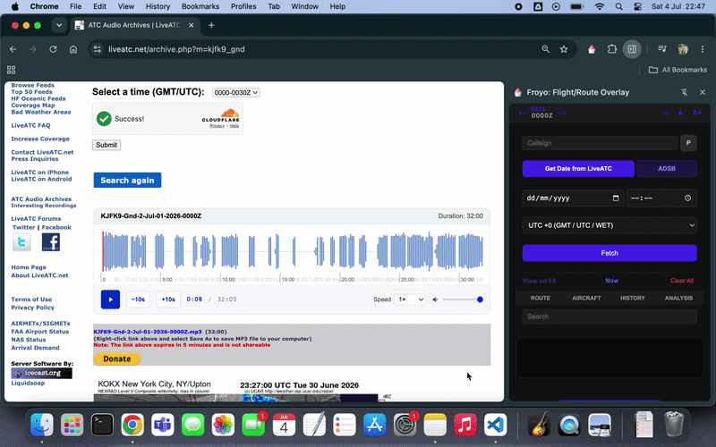

  

Open a LiveATC archive audio clip and click to pull the date, time and airport from the filename.

Click ADSB to launch the exact ADSB Exchange radar replay for that minute/airport.

Click any aircraft on the map, and its callsign instantly populates in Froyo. You can also type callsigns in directly when they are clearly heard.

Hit Fetch, and it pulls the full FlightAware IFR Route Analyzer path, registration info, and airframe history right into your sidebar.
